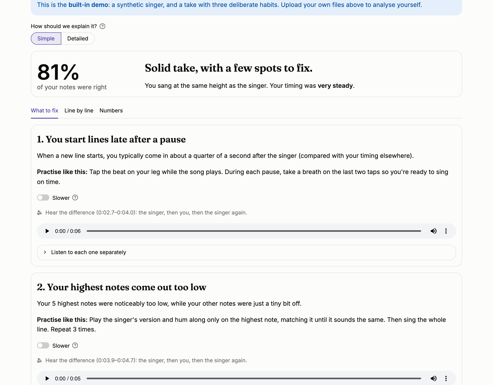
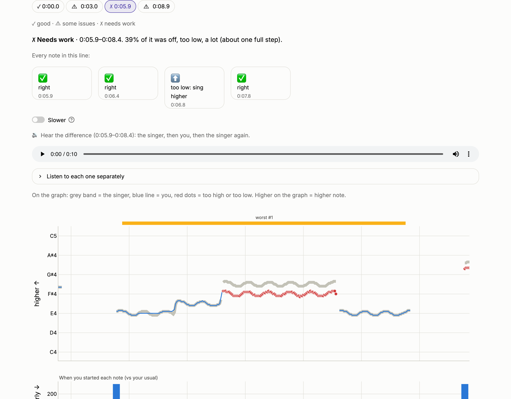
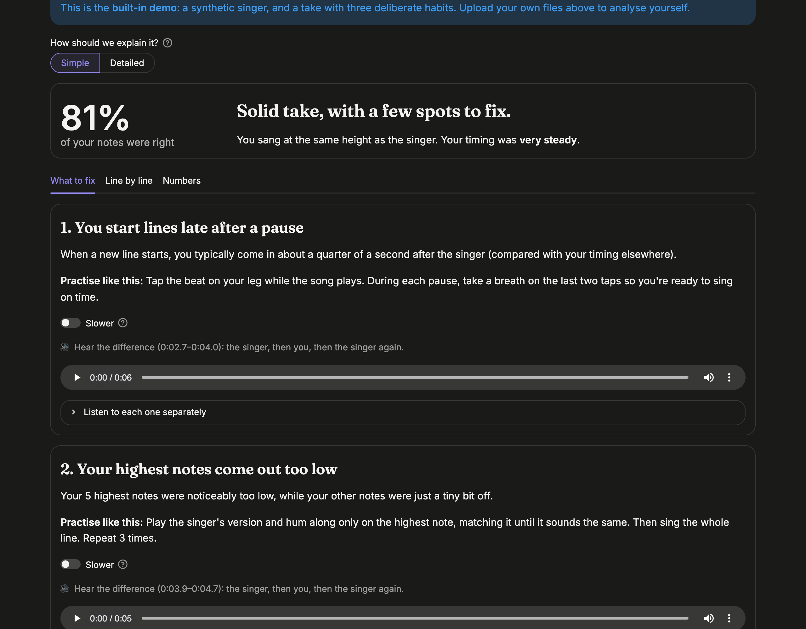

# Pitch Practice

Sing along to a song, upload your recording, and see **where** your pitch and timing
differed from the singer, with timestamps, plain-language tips, and the singer vs. you
side by side.

Apps like Smule and Yousician mostly give you a score. This one is built to answer
*"which notes, at what moment, and in which direction?"*, against any reference
you choose.



| Line by line: every note marked ✅ / ⬆️ sing higher / ⬇️ sing lower | Dark mode |
|---|---|
|  |  |

**Two ways to read it.** *Simple* (the default) uses everyday words: "too low",
"a small step", "a quarter of a second late", with beginner exercises and a
*Hear the difference* player (singer → you → singer, optionally slower). *Detailed*
uses music terms (flat, sharp, semitones, cents, ms). Same measurements, two
vocabularies; the graph is available in both.

*Screenshots use the built-in demo: a synthetic singer and a take with three
deliberate habits. No copyrighted audio is in this repository.*

---

## What's under the hood (honestly)

| Stage | Technique | Kind |
|---|---|---|
| Separate the singer from the music | [Demucs](https://github.com/facebookresearch/demucs) (HTDemucs) | **Pretrained deep neural network**, the only ML in the pipeline |
| Find the sung pitch every 10 ms | pYIN (`librosa.pyin`) | Classical signal processing: YIN + hidden Markov model |
| Find where the song starts in your take | Key-invariant lag search | Classical |
| Line up your timing with the singer's | Banded dynamic time warping (written here, numba-compiled) | Classical (dynamic programming) |
| Scores, phrases, tips | Rules over the measurements | Classical |

The tips are generated from the measurements with fixed templates. No language model
writes or invents any number.

## Quick start

Requires **Python 3.12** and **ffmpeg** (`brew install ffmpeg` on macOS).

```bash
git clone https://github.com/Aryav132/pitch-practic.git
cd pitch-practic
python3 -m venv .venv && source .venv/bin/activate
pip install -r requirements.txt                 # core app
pip install -r requirements-separation.txt      # Demucs, for full songs (PyTorch, ~1 GB)
streamlit run app.py
```

Open **http://127.0.0.1:8501** and click **See an example first**, or open
`http://127.0.0.1:8501/?demo=1` to land straight on the demo result.

Without the separation requirements, the app still works with a **solo vocal**
reference (tick *"This is already a solo vocal"*).

### How to record a take
1. 🎧 **Wear headphones**, so your phone records only you, not the song. If the
   song leaks into the recording, the app ends up comparing the singer with the
   singer.
2. Press record on your phone, then start the song at the point you'll enter in
   the app, then sing along (up to 60 s of singing, take up to 90 s).
3. A different key or octave is fine; it's detected and allowed for.

### Command line
```bash
python -m pitch_practice.cli song.mp3 my_take.m4a --start 30 --html reports/out.html
python -m pitch_practice.cli my_vocal.m4a my_take.m4a --clean-reference   # no separation
```

## How it works

1. **Load.** Every file is decoded with ffmpeg (MP3, phone M4A, WAV...) to mono
   float audio. Mono is a true channel average: ffmpeg's own downmix applies a
   −3 dB pan law.
2. **Separate (reference only).** Demucs runs at its native 44.1 kHz stereo on the
   chosen window plus 2 s of padding each side, and keeps the vocals. Stems are cached
   on disk, keyed by *file content hash + window + model*, so re-analysing a
   section is instant. On Apple Silicon it uses the GPU (MPS): about 32 s for 60 s of
   audio, versus about 119 s on CPU.
3. **Track pitch.** pYIN at 24 kHz with 10 ms frames, searching 60–1200 Hz for a
   C2–C6 singing range. Frames are marked unvoiced if pYIN's confidence is below
   0.05, if they are more than 40 dB below the loudest frame, or if they belong to a
   voiced fragment shorter than 100 ms.
4. **Find the start.** The phone starts recording before the song, at an unknown
   offset. For every possible lag we compare `take − reference` (in cents) over
   frames where both are voiced. At the right lag that difference is nearly
   constant (it equals the key difference), so the search is key-invariant.
   Unexplained reference frames are charged too, so a repeated chorus can't win by
   matching only part of the song.
5. **Key.** The median offset is removed. In the default *snapped* mode it is
   rounded to whole semitones, so singing in another key or octave is fine, but being
   40 cents flat throughout still counts.
6. **Align.** DTW within ±0.75 s of the lag. Non-diagonal steps cost extra, so
   DTW can't "warp around" a wrong note, and a warning is shown if the path hits the
   band edge.
7. **Score.** Pitch is judged only where both of you sing, within ±30 ms (so a slide
   sung slightly late isn't counted twice). Timing is judged only at **note starts**
   and relative to your own median, because the recording's start time makes absolute
   lateness unknowable. Phrases are split at rests; the worst ones are ranked.
8. **Coach.** Detectors look for habits across notes: scooping into notes, drifting
   flat on long notes, flat high notes, late phrase entries. Each habit must show up
   on at least 3 notes and 25% of eligible notes before it's mentioned.

## Limitations (please read before trusting a score)

- **Backing vocals and harmonies.** Demucs puts *all* voices in the vocal stem, so the
  reference line can jump between lead and harmony. Those parts can look like errors.
- **Reverb, echo and leftover instruments** in the separated vocals blur note ends
  and occasionally add stray reference notes.
- **Noisy or quiet recordings** lose notes (marked as "not sung"), and room noise can
  occasionally pass the filters.
- **Pitch vs timing can be confused.** If you sing a note that matches a *nearby*
  reference note, DTW (which aligns by pitch) may treat it as a timing slip rather
  than a wrong note. The ±0.75 s band caps this, and the app warns when it happens.
  Using onset information in the alignment would fix it; that's future work.
- **Absolute timing is unknowable.** "Late" always means *later than your own
  typical timing*, not later than the song.
- **Only the lead melody.** No harmony singing, no polyphony, no real-time feedback.
- **Separation is slow without a GPU.** A new song section takes minutes on a CPU-only
  server; cached sections are instant.
- **Tips are heuristics.** Each detector is tested to fire on synthetic takes with
  the habit and to stay silent on a perfect take, but real voices are messier.
  Practice suggestions are general singing advice, not measurements.

## Testing

```bash
pytest              # 128 fast tests, about 25 s
pytest -m slow      # + 1 test that runs the real Demucs model
```

Most tests use **synthetic signals with a known answer**: a melody sung 50 cents flat,
delayed 200 ms, shifted an octave (offset must come out ≈ 1200 cents), a held wrong
note DTW must not hide, a 30 ms-late slide the ±30 ms slack must forgive, a demo take
with three planted habits the coach must find (and nothing else). The DTW is checked
against `librosa.sequence.dtw` as an oracle.

## Project layout

```
app.py                      Streamlit UI (thin: collects input, shows the Report)
pitch_practice/
  audio_io.py               ffmpeg decoding, channel handling, hashing
  separation.py             Demucs wrapper + stem cache (NoSeparator for solo vocals)
  pitch.py                  pYIN tracker + voicing filters  (PitchTracker interface)
  alignment.py              lag search, key offset, banded DTW
  scoring.py                deviations, sections, note-start timing -> Report
  coaching.py               habit detectors -> plain-language tips
  playback.py               singer / you / right-notes audio clips
  plotting.py               Plotly figure (light + dark)
  pipeline.py               files in -> Report out (the only entry point the UI uses)
  config.py                 every threshold, with the measurement that justified it
  demo.py, synthesis.py     built-in synthetic demo
tests/                      pytest suite (synthetic signals)
scripts/                    manual checks + README screenshot generator
```

## Roadmap

- **Phase 2:** public deployment and feedback from about 8 singers. Does timestamped
  feedback help more than a single score?
- **Phase 3 (deep learning, clearly labelled):** torchcrepe as an alternative pitch
  tracker with a measured comparison against pYIN on real recordings; an LLM coach
  that *rephrases* the measured tips (never invents numbers).
- **Ideas, not yet decided:** measure your vocal range, and check whether an uploaded
  song fits it (and by how many semitones to transpose).

Not planned: accounts, a song library, real-time feedback, mobile apps.
